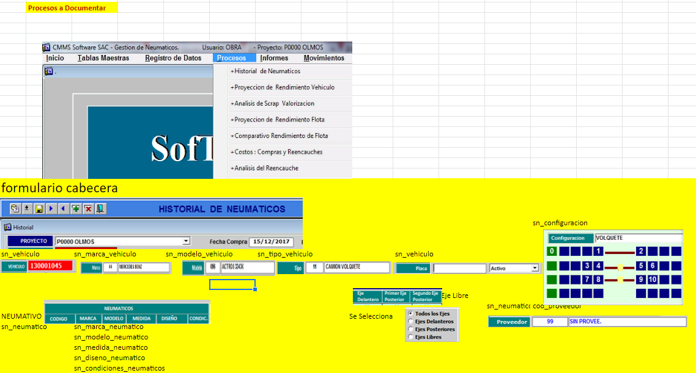
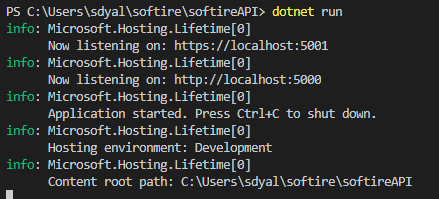

<p align="center">
  <a href="" rel="noopener">
 </a> </p>
<h3 align="center" style="font-size:3rem;">Softire  Project</h3>

<div align="center">
Dependencies:
https://dotnet.microsoft.com/download/dotnet-core/3.0
**.NET Core 3.0 SDK** -> provides `dotnet` console command

dotnet tool install --global dotnet-ef --version 3.0.0-preview6.19304.10 -> provides dotnet ef


Build:

```
git clone https://github.com/devrheber/softire.git
cd softire/softire
dotnet restore
dotnet run
```

After dotnet run "Kestrel" web server is deployed with 
http://localhost:5000
https://localhost:5001  <- Not recommended cuz visual studio dependencies


  []() 
  [](https://github.com/devrheber/softire/issues)
  [](https://github.com/kylelobo/The-Documentation-Compendium/pulls)
  [](LICENSE.md)

</div>

---

<p align="center"> Web and Proyect softire API
    <br> 
</p>

## 📝 Table of Contents
<!-- - [Problem Statement](#problem_statement) -->
<!-- - [Idea / Solution](#idea) -->
- [Dependencies / Limitations](#limitations)
<!-- - [Future Scope](#future_scope) -->
- [Setting up a local environment](#getting_started)
- [Usage](#usage)
- [Technology Stack](#tech_stack)
- [Contributing](../CONTRIBUTING.md)
- [Authors](#authors)
- [Acknowledgments](#acknowledgments)
<!---
## 🧐 Problem Statement <a name = "problem_statement"></a>
It is useful to design and follow a specific format when writing a problem statement. While there are several options
for doing this, the following is a simple and straightforward template often used in Business Analysis to maintain
focus on defining the problem.

- IDEAL: This section is used to describe the desired or “to be” state of the process or product. At large, this section 
should illustrate what the expected environment would look like once the solution is implemented.
- REALITY: This section is used to describe the current or “as is” state of the process or product. 
- CONSEQUENCES: This section is used to describe the impacts on the business if the problem is not fixed or improved upon.
This includes costs associated with loss of money, time, productivity, competitive advantage, and so forth.

Following this format will result in a workable document that can be used to understand the problem and elicit
requirements that will lead to a winning solution. 
## 💡 Idea / Solution <a name = "idea"></a>
This section is used to describe potential solutions. 

Once the ideal, reality, and consequences sections have been 
completed, and understood, it becomes easier to provide a solution for solving the problem.
-->

## ⛓️ Dependencies / Limitations <a name = "limitations"></a>
- Visual Studio 2019 preview
- .NET 3 Core

## 🚀 Future Scope <a name = "future_scope"></a>
Write about what you could not develop during the course of the Hackathon; and about what your project can achieve 
in the future.

## 🏁 Getting Started <a name = "getting_started"></a>
These instructions will get you a copy of the project up and running on your local machine for development 
and testing purposes. See [deployment](#deployment) for notes on how to deploy the project on a live system.

### Prerequisites

Install .NET Core 3.0 on your system.
https://dotnet.microsoft.com/download/dotnet-core/3.0

#### verify installation
```
C:\Users\user>dotnet --version
3.0.100-preview6-012264
```

### Setup

Clone the repo
```
git clone https://github.com/sdyalor/softire.api.git
```
cd to the project directory

```
cd softire.api
```
Reinstall dependencies
```
dotnet restore
```
Run the develop environment
```
dotnet run
```
After this stage the app should expose the 5000 http port and 5001 https
but the app works with https forced by default

## 🎈 Usage <a name="usage"></a>

The basic test to the api is a curl to the https port with the table endpoint
```
curl -4 https://localhost:5000/graphql
```
</a>

## ⛏️ Built With <a name = "tech_stack"></a>
- [SQL Server Express](https://www.microsoft.com/en-us/sql-server/sql-server-editions-express) - Database
- [Entity Framework Core](https://docs.microsoft.com/en-us/ef/core/) - Server Framework
- [.NET Core 3.0](https://dotnet.microsoft.com/download/dotnet-core/3.0) - Server Environment

## ✍️ Authors <a name = "authors"></a>
- [sdyalor](https://github.com/sdyalor) - Idea & Initial work

See also the list of [contributors](https://github.com/devrheber/softire/contributors) 
who participated in this project.

## 🎉 Acknowledgments <a name = "acknowledgments"></a>
- Graphql core 
- Inspiration
- References